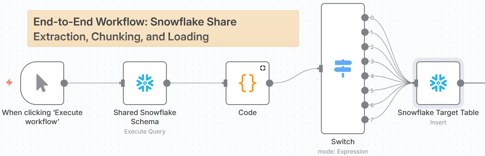
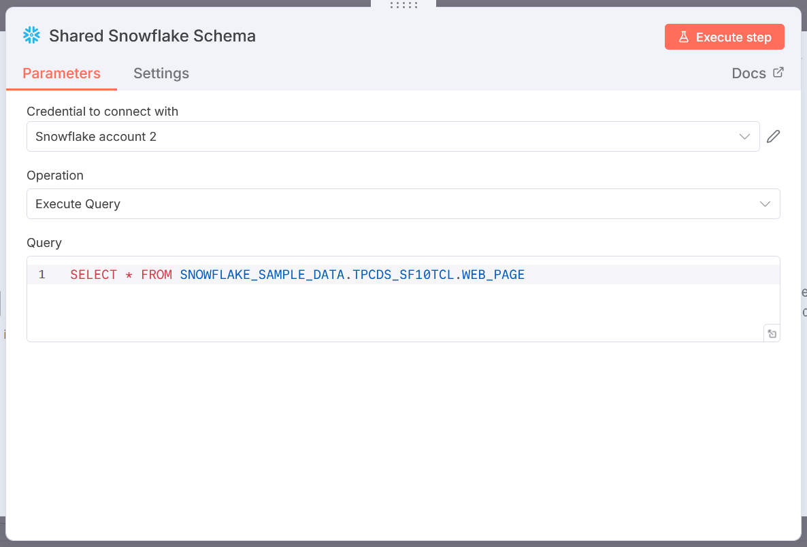
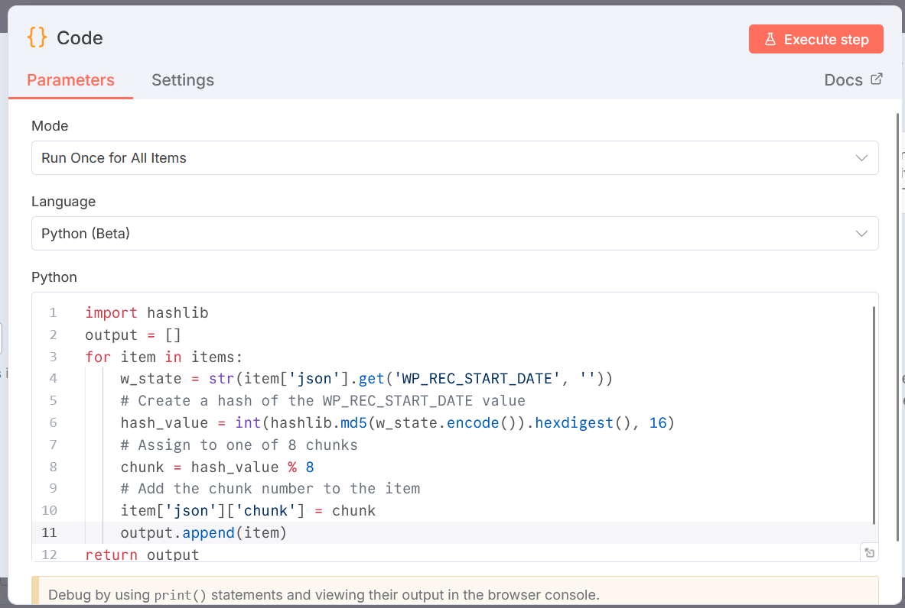
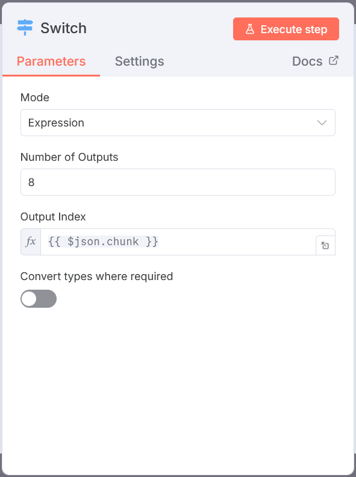
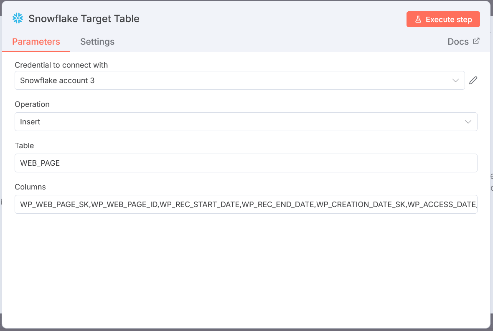
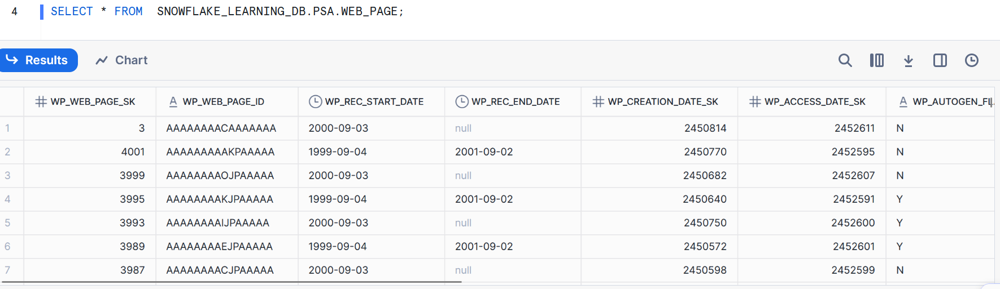
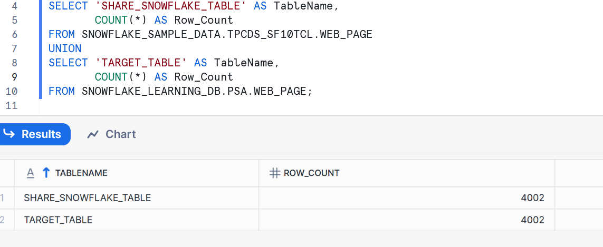

# n8n-snowflake-share-etl

> ⚡ Automate **Snowflake Share Loading** with **n8n + Hashing** → Scalable, Low-Code ETL for Modern Data Engineering 🚀

This repository contains an **end-to-end n8n workflow** that automates **loading data from a Snowflake Share** into a target Snowflake table using a **hashing-based chunking method**.  

It demonstrates how to:  
- Load data from a Snowflake share schema  
- Partition and chunk records using hashing logic  
- Dynamically route chunks for parallelized processing  
- Insert transformed data into a target Snowflake table  

---

## 🚀 Workflow Overview  

## Highlevel Workflow

The workflow consists of the following steps:

### 1. **Trigger Node**
- **Node:** `When clicking 'Execute workflow'`  
- **Purpose:** Starts the workflow on-demand.  
- **Why:** Useful for manual execution, debugging, or controlled runs.  

---

### 2. **Shared Snowflake Schema**
- **Node Type:** `Snowflake → Execute Query`  
- **Purpose:** Reads records from the **Snowflake Share** schema.  
- **Why:** Serves as the raw input dataset for the pipeline.  

---

### 3. **Code Node (Hashing & Chunking)**
- **Node Type:** `Code`  
- **Purpose:** Applies a **hashing method** to partition the dataset into chunks.  
- **Why:** Ensures efficient, balanced distribution of data across multiple insert operations.  

---

### 4. **Switch Node**
- **Node Type:** `Switch (Expression mode)`  
- **Purpose:** Routes each hashed chunk to the appropriate path.  
- **Why:** Provides flexibility in parallelizing inserts or applying different logic per chunk. 
 

---

### 5. **Snowflake Target Table**
- **Node Type:** `Snowflake → Insert`  
- **Purpose:** Loads each hashed data chunk into the final target Snowflake table.  
- **Why:** Completes the **data loading process** from Snowflake Share → Target Table.  
 
---

## 🎯 Use Case  

This workflow solves the challenge of **loading shared Snowflake data into target tables at scale** by:  
- Leveraging **hashing** to create evenly distributed data partitions  
- Reducing risk of oversized transactions or bottlenecks  
- Providing a low-code framework for automating Snowflake share consumption  

It can also be adapted for:  
- Multi-chunk data pipelines  
- Loading Snowflake shares into production schemas  
- Integrating Snowflake shares with other ETL sources (e.g., MongoDB → Snowflake)  

---

## 📈 Scaling to Larger Datasets  

📝 **Note:**  
The demo included in this repository runs on a smaller dataset of ~4,000 records for demonstration purposes.  

For **production-scale datasets (millions of records)**, you can scale up the workflow by adjusting or Tweaking N8N nodes.

---

## 📸 Results & Demo  
 
### Snowflake Results

 

### Result Comparison

### Illustration Video
